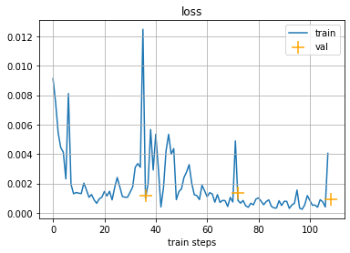
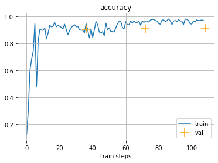

# DogsBreeds

- Проект включает CV pipeline и сервис на Flask для классификации пород собак
- CV pipeline реализован на PyTorch и обеспечивает автоматическое логирование
и проведение экспериментов с разными DL архитектурами классификации изображений:
    - mobilenet_v2
    - resnet18
    - **densenet161 (лучшая модель)**
    - densenet201
  ### Результаты экспериментов:

Получена accuracy - **0.951**

Presicion score for each class:

    Метка -     Presicion score -   Название породы -   доля от train выборки

    0 -         0.97310513 -        ши-тцу                     - 10.4 %

    1 -         0.96813725 -        родезийский риджбек        - 10.4 %

    2 -         0.85645933 -        бигль                      - 10.3 %

    3 -         0.90178571 -        английский фоксхаунд       - 6.4 %

    4 -         0.96758105 -        бордер-терьер              - 10.5 %

    5 -         0.92383292 -        австралийский терьер       - 10.4 %

    6 -         0.98004988 -        золотистый ретривер        - 10.5 %

    7 -         0.98341232 -        староанглийская овчарка    - 10.2 %

    8 -         0.98601399 -        самоед                     - 10.2 %

    9 -         0.95365854 -        динго                      - 10.2 %

- В сервисе используется лучшая модель для предсказания породы собаки - densenet161

## Структура

- Pipeline - каталог с CV pipeline
- Service - каталог с сервисом на Flask + Dockerfile
- Tgbot - каталог с Telegram bot-ом классифицирующим породы собак
- Dogs Breeds - ноутбук с разведочным анализом и черновиками pipeline

## Дополнительно
- В проекте реализован Docker образ для сервиса на Flask
- Реализован Telegram bot классифицирующий породы собак